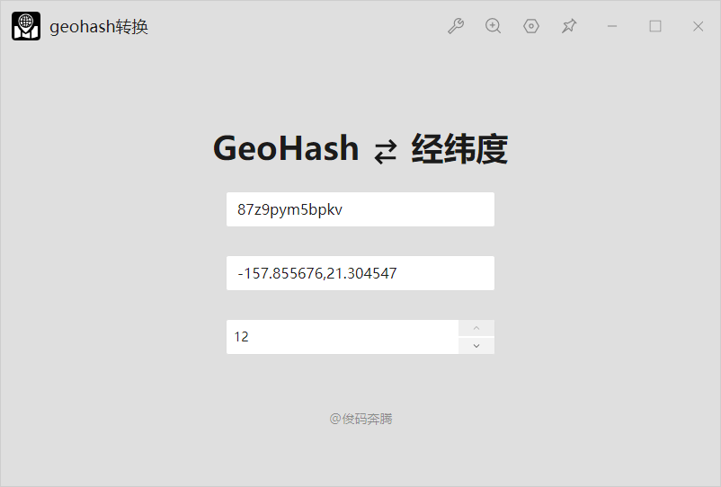
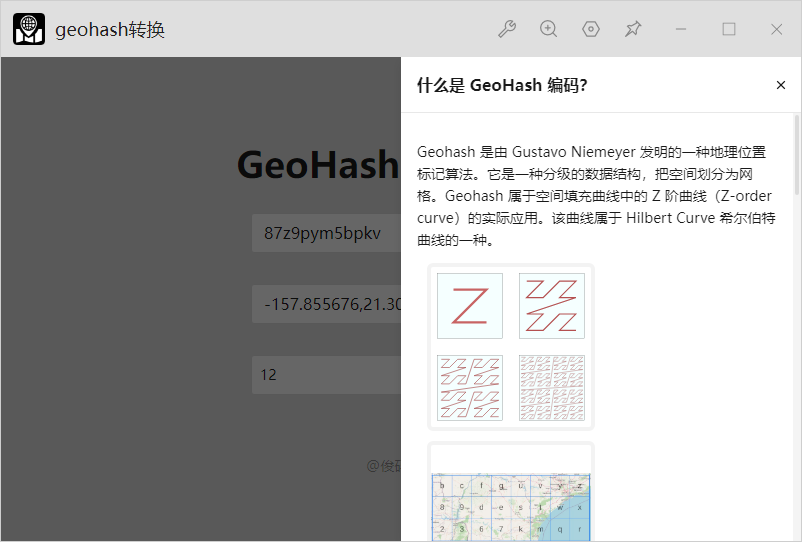

# geohash-helper

一个地理位置编码小工具，支持经纬度坐标 (lng, lat) 和 geohash 相互转换。

A codec converter of geohash and coordinate(lng, lat).

> uTools插件
> 
> [uTools插件市场](https://www.u.tools/plugins/) 在线安装。（搜索关键字：`geohash`）
> 
> 离线安装：从 Releases 下载 `geohash助手-x.x.x.upxs`

> Plugin for uTools
> 
> You can install it from online [uTools's plugins market](https://www.u.tools/plugins/) . (search keyword `geohash`)；
> 
> If you work offline, download from Releases `geohash助手-x.x.x.upxs`.

## Features
+ Supports encoding coordinate(lng, lat) to geohash.
+ Supports decoding geohash to coordinate(lng, lat).
+ Supports setting precition between 1 and 12.

## Screenshots

## Version logs
### v0.0.1
1. 实现 GeoHash 到 (lng, lat) 中心经纬度的解码和编码；
2. 实现 GeoHash 长度和精度控制；
3. 编写 GeoHash 简要原理说明和参考资料来源；

## References 
参考资料：
+ [Wiki：Z-order_curve](https://en.wikipedia.org/wiki/Z-order_curve)
+ [Wiki：Geohash](https://en.wikipedia.org/wiki/Geohash) 
+ [geohash.co](http://geohash.co) 
+ [逆锋起笔 GeoHash C#版](https://www.cnblogs.com/nifengqibi/p/15039114.html)